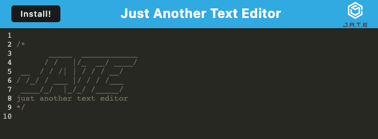

# text-editor

## Description

The Text Editor is a Progressive Web App that allows users to add text to the editor, have the data stored to IndexDB and Local Storage and have data persist after refreshes or closing and restarting the browser. The Text Editor is also able to function offline and is installable. 

I was able to demonstrate what I have learned throughout the Carleton University Full Stack Coding Bootcamp as well as use my researching skills to find and complete this program.

## Installation

You will need to install [node.JS](https://nodejs.org/en/download)

You will also have to install the package.json file through npm run install.

## Usage

- You can use the application online or offline by typing into the text editor.
- You can use the install button to install the PWA to your device.

## Credits

Base Code for HTML and CSS supplied by CARL-VIRT-FSF-PT-01-2023-U-LOLC GitLab Repository.

## License

The License used was the [MIT License](https://choosealicense.com/licenses/mit/). Also found in repository under LICENSE.

## Questions

If you have any questions, please reachout via [GitHub](https://github.com/mdeluca13/).